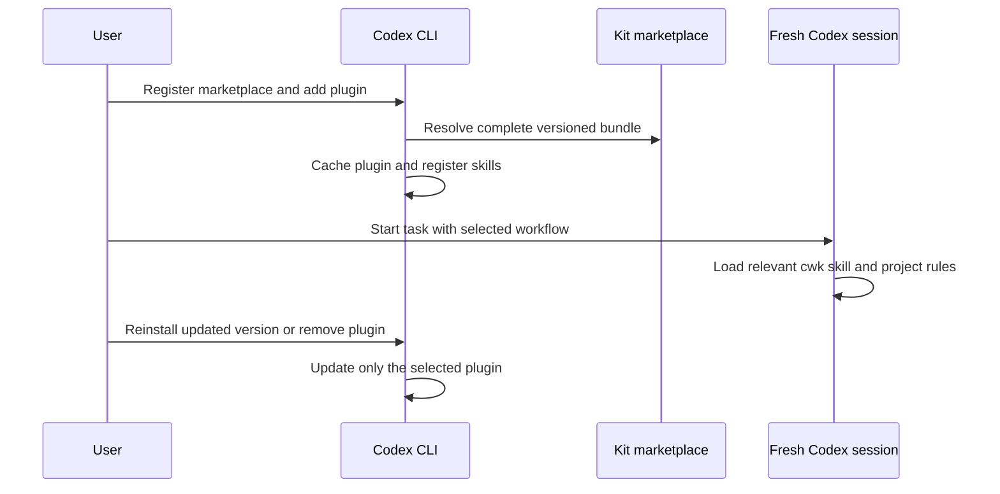

# Public Beta Design

## Overview

Deliver a versioned Codex plugin and reproducible validation for 0.1.0-beta. Prefer native Codex plugin installation over a new global synchronization engine. Keep eight core skills and optional project rule fragments.

## Architecture

- plugins/codex-workflow-kit/: independently named plugin manifest, eight cwk-prefixed skills and retained licenses.
- .agents/plugins/marketplace.json: repository marketplace resolving the local plugin directory.
- templates/: optional project rules, core and Kiro/delegation fragments. No installer writes AGENTS or model settings.
- scripts/: read-only checks, deterministic archive packaging and an isolated native CLI lifecycle test.
- evals/routing/: answer-free public-catalog selection evaluation with explicit skills-only or core profile.
- evals/behavior/: isolated fixtures and real-session runner; results include sanitized raw observations and actual artifact checks.
- .github/: fast checks and contribution templates; hosted configuration follows the user-created repository.

## Component / Data / Workflow Design

Rename both skill directory and frontmatter names to cwk-route, cwk-design, cwk-plan, cwk-execute, cwk-tdd, cwk-debug, cwk-review and cwk-verify. Preserve an old-to-new provenance mapping and all references. Keep automatic invocation settings unchanged; explicit cwk selection and project provider preference distinguish equivalent workflows. Test coexistence rather than inferring it from names alone.

The repo marketplace includes only the kit. Native Codex CLI registers that marketplace and installs, refreshes and removes its plugin. Test commands with temporary HOME/CODEX_HOME and no inherited personal workflow. Auth for real model tests may reuse the existing login through a protected temporary copy without printing or publishing it. Never bundle auth, real machine configuration or session caches.

Build release archives only from reviewed allowlisted paths, with stable archive metadata and licenses. The publication manifest records candidate files; package checks separately enforce the runtime bundle. Do not add files to the allowlist merely to silence an unexpected-file finding.

Evaluation metadata records host version, model settings, plugin content hash and rule profile. Routing inputs expose descriptions and requests without the rubric. Real behavior fixtures use actual file changes, test outcomes and traces, including refusal to weaken required review. Preserve failed observations and rerun only after relevant changes. No model score or host compatibility claim is transferred from the prior private workflow.

## Constraints / Tradeoffs

Start with the available macOS arm64 Codex CLI; other surfaces remain experimental until exercised. No arbitrary model/version support promise, session-start hook, automatic global rules installation or telemetry. Eight skills ship as one bundle to preserve cross-skill reference integrity.

Use v6.2.0-derived material with explicit v6.3.0 comparison; do not overwrite local policy choices with an upstream bulk update. The user creates the public repository. Maintainer confirmation is required for publication rights and final license adoption.

## Sequence Diagrams

## Testing Strategy

Write executable contract tests before packaging/evaluation-tool implementation. Exercise determinism, resource completeness, unlisted/unsafe files and profile identity. Run actual native install/fresh-session/update/remove operations in temporary state. Execute routing and behavior evaluation against the installed content, with original observations and evidence review. Run fast tests in CI without credentials; live model runs remain explicit. Record gaps and external decisions in tasks.md, the sole task-state source.
